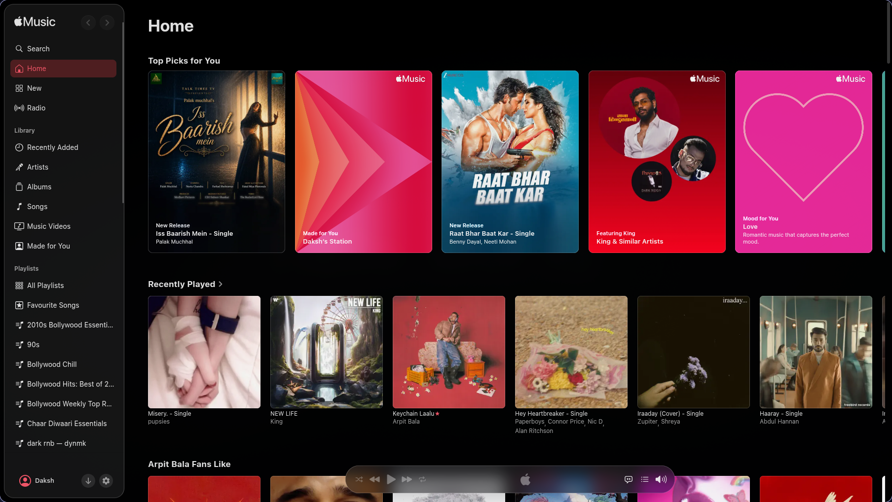
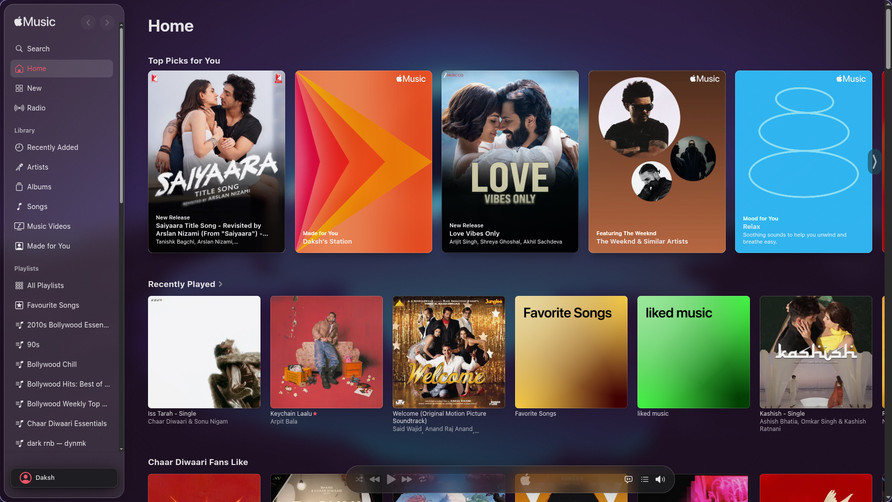
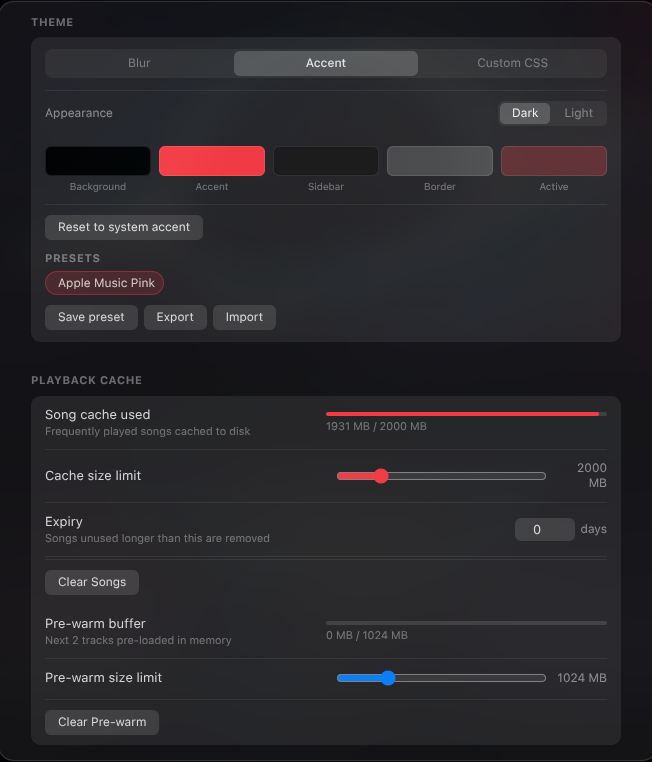
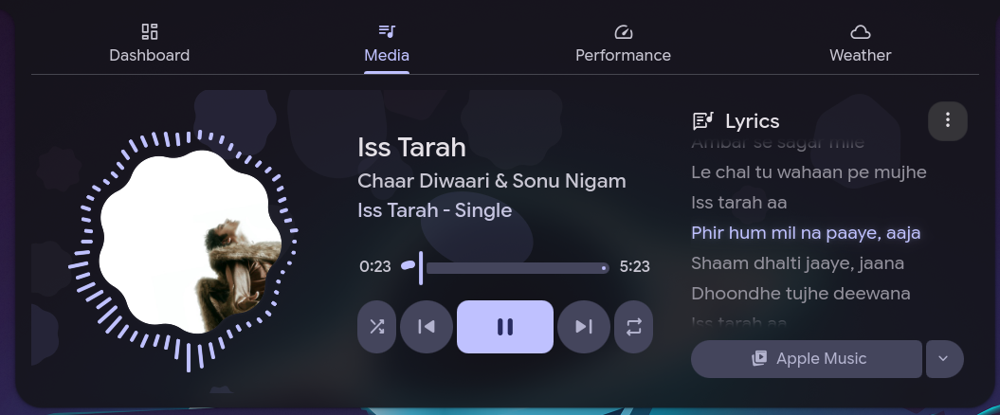
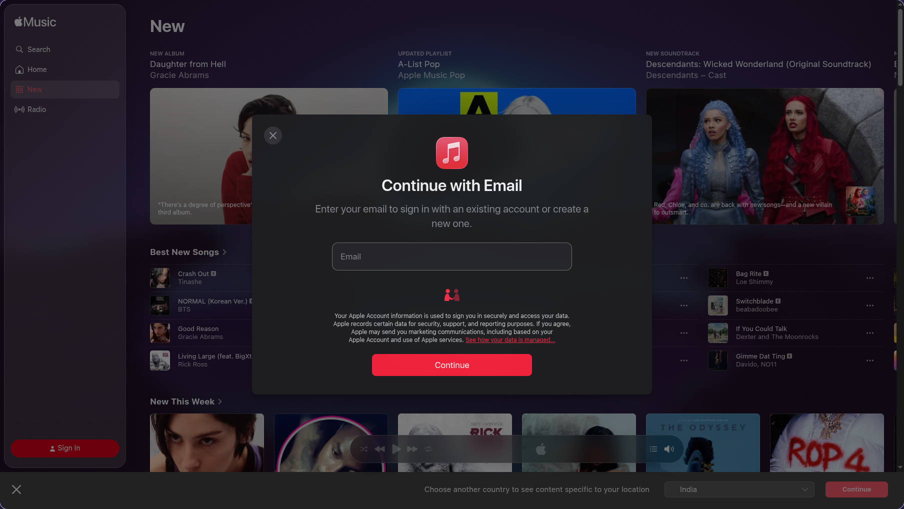
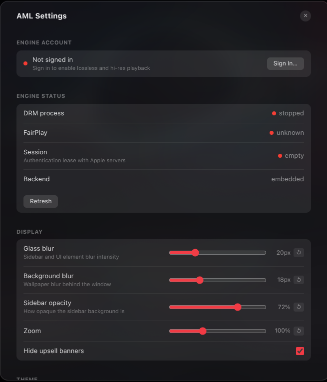
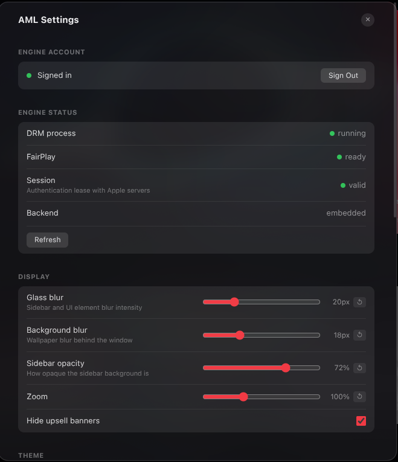

<div align="center">

# Apple Music Linux

[](https://github.com/silentone12725/apple-music-linux/releases/latest)
[](LICENSE)
[](https://github.com/silentone12725/apple-music-linux/releases/latest)

An Apple Music desktop client for Linux — lossless audio, music videos, downloads, and a native-feeling UI.

<div align="center">
  
  
</div>

</div>

> [!IMPORTANT]
> **Disclaimer**
>
> This project is not affiliated with, authorized by, or endorsed by Apple Inc. in any way. "Apple Music", "Apple", and related names are trademarks of Apple Inc. used here for identification purposes only.
>
> This app is provided "AS IS" with no warranty. Use at your own risk. An active Apple Music subscription is required.

## Contents

- [Features](#features)
- [Roadmap](#roadmap)
- [Requirements](#requirements)
- [Download & Install](#download--install)
- [Login](#login)
- [Dev](#dev)
- [Build](#build)
- [Project structure](#project-structure)
- [References](#references)

## Features

### Playback
- **Lossless & Hi-Res** — ALAC up to 192kHz via FairPlay-decrypted HLS
- **AAC streaming** — dedicated MSE pipeline for AAC with accurate seek
- **Music Videos** — full MV playback with resolution selector (480p → 4K), subtitles, fullscreen, and seek; H.264-preferred to avoid HEVC decode issues on Linux
- **Audio quality badge** — shows codec, bit depth, and sample rate right in the player bar; click for full details

### Downloads
- Save individual tracks, full albums, or entire playlists to disk in one click
- Music videos download as a properly muxed file (audio + video combined)
- Live byte-by-byte progress during download
- Configurable filename templates: `{artist}`, `{album}`, `{quality}`, `{isrc}`, `{release_date}`, and more
- Cover art embedded in every file, including FLAC
- Output folder configurable via a native folder picker

### Themes & Appearance
- **Three theme modes**: glass blur, system/custom accent colour, or a fully custom CSS file
- Automatically picks up your system accent colour from KDE, Hyprland, or GNOME
- Save and share your own theme presets (export/import JSON)
- Adjustable blur strength and sidebar opacity sliders
- Light and dark mode support

<div align="center">
  
</div>

### Compositor & Blur
- Native `blur-behind` on KDE X11 (KWin) and KDE Wayland — no screen-share dialog
- Hyprland wallpaper blur via `hyprpaper` / `swww`
- Software blur fallback on X11, GNOME, and Sway
- Automatically switches to software blur if the GPU crashes

### System Integration
- **MPRIS2** — play/pause, next/prev, seek, and shuffle via D-Bus (works with KDE, GNOME shell, Waybar, etc.)

<div align="center">
  
</div>

- **Media keys** — hardware play/pause, next, and previous keys work even when the window is in the background (includes Bluetooth AVRCP)
- **System tray** — minimize to tray; playback controls in the right-click menu
- **Wayland + X11** — tested on Hyprland, KDE Plasma, GNOME, and Sway

### Other
- Back / Forward navigation buttons in the sidebar header
- Smart segment cache — tracks pre-warmed before you press play
- Separate cache for music video segments (2 GiB by default, adjustable)
- Settings auto-save with visual confirmation

## Roadmap

- **Playback handoff** — clean transitions between AAC, lossless, and music video modes without stalls, double-plays, or state leaks
- **Notifications** — now-playing OSD with artwork on track change
- **arm64 support** — packaging and wrapper binary for Apple Silicon / Raspberry Pi
- **EQ Studio** — per-headphone parametric EQ from autoeq.app (engine ready, UI coming)

## Requirements

- Linux x86_64
- glibc ≥ 2.28 (Ubuntu 20.04+, Fedora 34+, Debian 11+)
- PulseAudio or PipeWire
- Apple Music subscription

VLC is bundled inside the installer — no system VLC needed.

A Wayland compositor with blur support (Hyprland, KWin) gives the best glass UI. X11, GNOME, and Sway use a software blur fallback.

## Download & Install

Two formats are available. Both contain the same build.

### Option A — `.run` installer (123 MB, recommended)

No dependencies, no root required for a user install.

```bash
chmod +x apple-music-linux.run
./apple-music-linux.run
```

This installs to `~/.local/lib/apple-music-linux` and adds a launcher to `~/.local/bin`. A desktop entry and icon are registered automatically.

**Other install options:**

```bash
./apple-music-linux.run --system      # install system-wide to /opt/ (needs sudo)
./apple-music-linux.run --force       # overwrite an existing installation
./apple-music-linux.run --uninstall   # remove the installation
./apple-music-linux.run --help        # show all options
```

After install, launch from your app menu or run `apple-music-linux` in a terminal.

### Option B — AppImage (184 MB, portable)

No install needed — just run it directly.

```bash
chmod +x apple-music-linux.AppImage
./apple-music-linux.AppImage
```

[AppImageLauncher](https://github.com/TheAssassin/AppImageLauncher) can integrate it into your app menu automatically on first run.

> **AppImage on Ubuntu 22.04+ / Fedora**: requires `libfuse2`.
> ```bash
> sudo apt install libfuse2   # Ubuntu/Debian
> sudo dnf install fuse       # Fedora
> ```
> Or run without FUSE: `./apple-music-linux.AppImage --appimage-extract-and-run`

### Unprivileged user namespaces (Ubuntu 23.10+, Debian 12+)

The FairPlay layer requires unprivileged user namespaces. Some newer distros restrict this via AppArmor. If the app shows an error about this:

```bash
# Temporary (until reboot)
sudo sysctl -w kernel.unprivileged_userns_clone=1

# Permanent
echo 'kernel.unprivileged_userns_clone = 1' | sudo tee /etc/sysctl.d/99-userns.conf
sudo sysctl -p /etc/sysctl.d/99-userns.conf
```

### GNOME

The system tray requires the [AppIndicator extension](https://extensions.gnome.org/extension/615/appindicator-support/). The glass UI uses a software blur fallback on GNOME — Mutter does not support compositor blur-behind.

## Login

Two separate sign-ins are required.

### 1. Apple Music web session

Sign in on first launch the same way you would at music.apple.com.

<div align="center">
  
</div>

### 2. Engine DRM account (lossless, hi-res & music videos)

This authenticates the FairPlay layer. Without it, playback falls back to AAC 256 kbps and music videos are unavailable.

1. Click the **Settings** cog wheel next to your account button
2. Click **Sign In**, enter your Apple ID, and wait about 20 seconds for the backend to authenticate and fetch the key

<div align="center">
  
  
</div>

## Dev

```bash
git clone https://github.com/silentone12725/apple-music-linux
cd apple-music-linux/electron
bash build.sh
```

`build.sh` installs npm dependencies, bundles system VLC libs into `dist/resources/vlc`, and launches the app.

**Dependencies:**

```bash
# Arch
sudo pacman -S vlc nodejs npm

# Ubuntu/Debian
sudo apt install vlc nodejs npm
```

**Rebuild the Go engine:**

```bash
cd engine
go build -o ../electron/dist/resources/engine .
```

## Build

```bash
# AppImage
cd electron
bash build.sh
NODE_ENV=production npm run dist
# → dist/apple-music-linux.AppImage

# .run SFX installer (requires the AppImage first)
cd ..
bash build-installer.sh
# → dist/apple-music-linux.run
```

## Project structure

```
electron/src/engine-playback.js   — playback engine injected into the Apple Music webview
electron/src/vision-glass.js      — glass UI and CSS injected into the webview
electron/main.mjs                 — Electron main process (IPC, MPRIS, tray, themes)
electron/preload.cjs              — IPC bridge exposed to the renderer
engine/                           — Go HTTP server (audio sessions, DRM, cache, VLC)
drm/                              — Android DRM environment (rootless)
```

## References

- [apple-music-engine](https://github.com/silentone12725/apple-music-engine-dev) — Go backend: FairPlay DRM, HLS decryption, lossless streaming, SSE event bus, smart prefetch cache
- [Electron](https://electronjs.org) — desktop shell
- [libvlc](https://www.videolan.org/vlc/libvlc.html) — audio/video playback
- [mpris-service](https://github.com/dbkr/mpris-service) — MPRIS2 D-Bus
- [MusicKit JS](https://developer.apple.com/documentation/musickitjs) — Apple's web playback SDK (loaded from music.apple.com)
- [electron-builder](https://www.electron.build) — AppImage packaging
