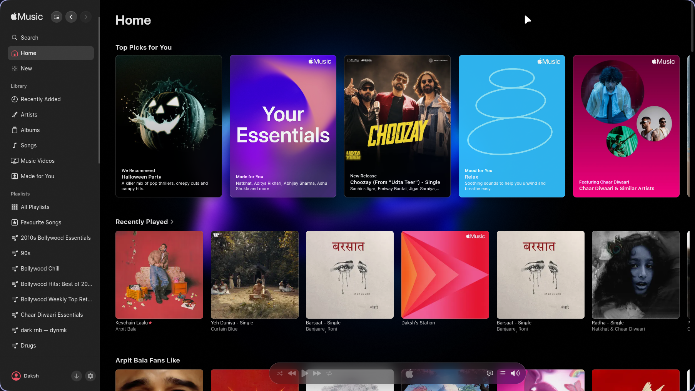
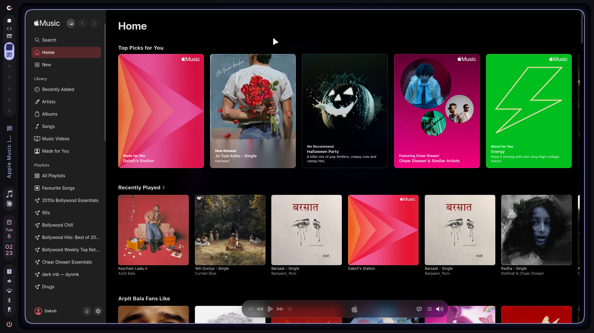
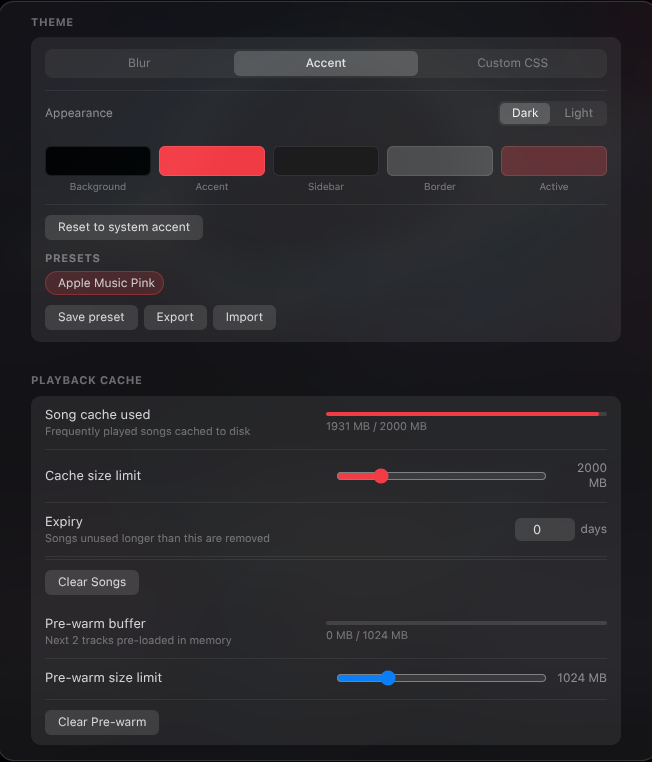
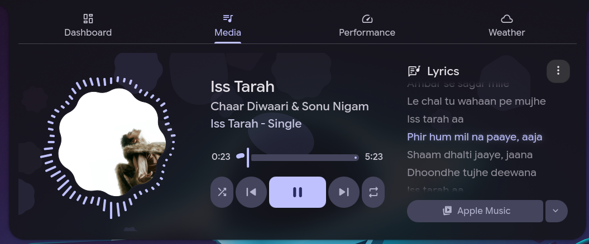
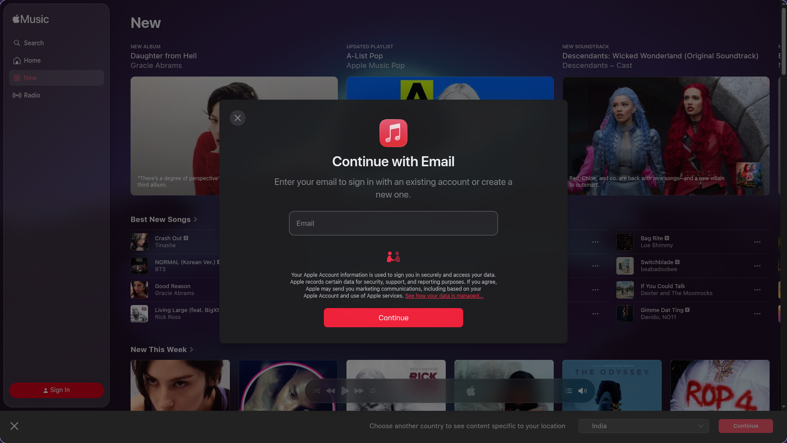
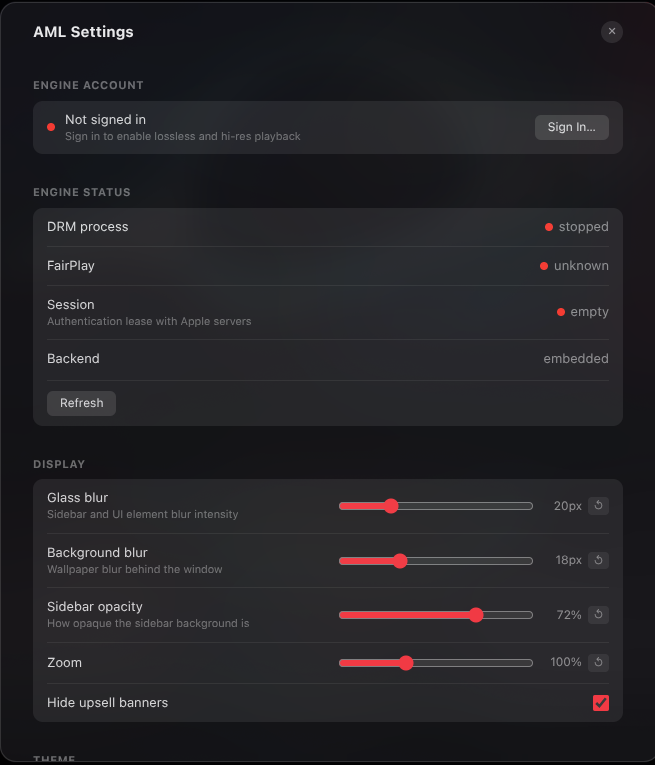
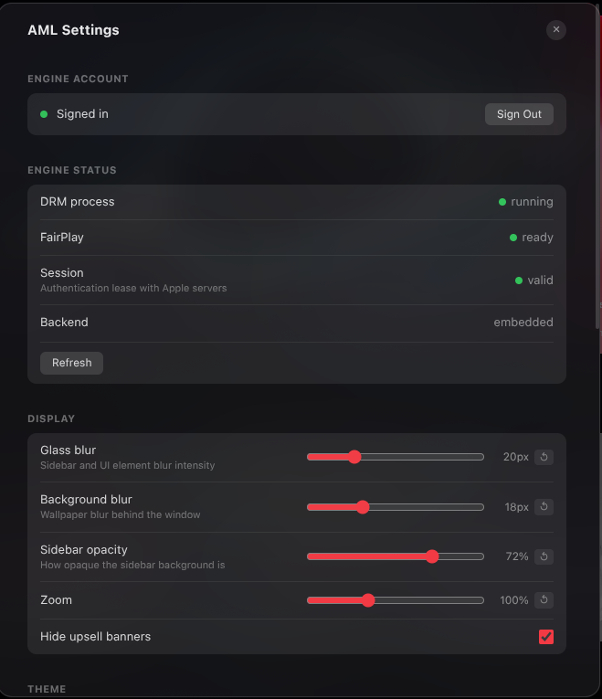

<div align="center">

# Apple Music Linux

[](https://github.com/silentone12725/apple-music-linux/releases/latest)
[](LICENSE)
[](https://github.com/silentone12725/apple-music-linux/releases/latest)

An Apple Music desktop client for Linux — lossless audio, music videos, downloads, and a native-feeling UI.

<div align="center">
  
  
</div>

</div>

> [!IMPORTANT]
> **Disclaimer**
>
> **No Affiliation**
>
> This project and its contributors are not affiliated with, authorized by, endorsed by, or in any way officially connected with Apple Inc. or any of its subsidiaries or affiliates. This is an independent, unofficial client developed for personal use.
>
> **Trademarks**
>
> "Apple Music", "Apple", and related names, marks, and logos are registered trademarks of Apple Inc. Any use of these trademarks is for identification and reference purposes only and does not imply any association with the trademark holder.
>
> **Limitation of Liability**
>
> This application is provided "AS IS". The developers are not liable for any claim, damages, or legal consequences arising from its use. You use it entirely at your own risk. An active Apple Music subscription is required.

## Contents

- [Features](#features)
- [Roadmap](#roadmap)
- [Requirements](#requirements)
- [Download & Install](#download--install)
- [Login](#login)
- [Dev](#dev)
- [Build](#build)
- [Project structure](#project-structure)
- [Changelog](#changelog)
- [References](#references)

## Features

### Playback
- **Lossless & Hi-Res** — ALAC up to 192kHz via FairPlay-decrypted HLS
- **AAC streaming** — dedicated MSE pipeline for AAC with accurate seek
- **In-process DRM** — FairPlay runs inside the engine, with no helper process or local sockets
- **Clean mode switching** — moving between lossless, AAC and music video stops the previous player first, so tracks never overlap
- **Music Videos** — full MV playback with resolution selector (480p → 4K), subtitles, fullscreen, and fast fragment-level seeking; H.264-preferred to avoid HEVC decode issues on Linux
- **Audio quality badge** — shows codec, bit depth, and sample rate right in the player bar; click for full details

### Downloads
- Save individual tracks, full albums, or entire playlists to disk in one click
- Music videos download as a properly muxed file (audio + video combined)
- Live byte-by-byte progress during download
- Configurable filename templates: `{artist}`, `{album}`, `{quality}`, `{isrc}`, `{release_date}`, and more
- Cover art embedded in every file, including FLAC
- Output folder configurable via a native folder picker

### Themes & Appearance
- **Three theme modes**: Blur (wallpaper blurred behind the app), Accent (system or custom accent colour), or a fully custom CSS file
- **Album art theming** — album and playlist pages take their colours from the artwork, and follow the playing track
- Automatically picks up your system accent colour from KDE, Hyprland, or GNOME
- Save and share your own theme presets (export/import JSON)
- Adjustable blur strength and sidebar opacity sliders
- Light and dark mode support

<div align="center">
  
</div>

### Compositor & Blur
- Native `blur-behind` on KDE X11 (KWin) and KDE Wayland — no screen-share dialog
- Hyprland wallpaper blur via `hyprpaper` / `swww`
- Software blur fallback on X11, GNOME, and Sway
- Automatically switches to software blur if the GPU crashes

### System Integration
- **MPRIS2** — play/pause, next/prev, seek, and shuffle via D-Bus (works with KDE, GNOME shell, Waybar, etc.)

<div align="center">
  
</div>

- **Media keys** — hardware play/pause, next, and previous keys work even when the window is in the background (includes Bluetooth AVRCP)
- **System tray** — minimize to tray; playback controls in the right-click menu
- **Mini player** — a small always-on-top now-playing window
- **Discord Rich Presence**, **Last.fm** and **ListenBrainz** scrobbling
- **Wayland + X11** — tested on Hyprland, KDE Plasma, GNOME, and Sway

### Other
- **Play History** — last 30 songs shown in the native Up Next panel; click any to replay; persists across restarts
- Back / Forward navigation buttons in the sidebar header
- Smart segment cache — tracks pre-warmed before you press play
- Separate cache for music video segments (2 GiB by default, adjustable)
- Encrypted local library cache that persists across restarts
- Settings auto-save with visual confirmation

## Roadmap

- **arm64 support** — packaging and wrapper binary for Apple Silicon / Raspberry Pi
- **AutoEQ** — per-headphone parametric EQ from autoeq.app, with an EQ Studio panel in Settings (engine package ready; not yet wired into playback or the UI)
- **Cavern** — lossless Dolby Atmos binaural rendering through CavernPipeServer, opt-in via `scripts/install-cavern.sh` (engine package ready; not yet wired into playback)

## Requirements

- Linux x86_64
- glibc ≥ 2.28 (Ubuntu 20.04+, Fedora 34+, Debian 11+)
- PulseAudio or PipeWire
- Apple Music subscription

VLC and a minimal FFmpeg are bundled in every package — no system VLC or FFmpeg needed.

A Wayland compositor with blur support (Hyprland, KWin) gives the best glass UI. X11, GNOME, and Sway use a software blur fallback.

## Download & Install

Three formats are available. They contain the same build.

### Option A — `.run` installer (113 MB, recommended)

No dependencies, no root required for a user install.

```bash
chmod +x apple-music-linux.run
./apple-music-linux.run
```

This installs to `~/.local/lib/apple-music-linux` and adds a launcher to `~/.local/bin`. A desktop entry and icon are registered automatically.

**Other install options:**

```bash
./apple-music-linux.run --system      # install system-wide to /opt/ (needs sudo)
./apple-music-linux.run --force       # overwrite an existing installation
./apple-music-linux.run --uninstall   # remove the installation
./apple-music-linux.run --help        # show all options
```

After install, launch from your app menu or run `apple-music-linux` in a terminal.

### Option B — AppImage (162 MB, portable)

No install needed — just run it directly.

```bash
chmod +x apple-music-linux.AppImage
./apple-music-linux.AppImage
```

[AppImageLauncher](https://github.com/TheAssassin/AppImageLauncher) can integrate it into your app menu automatically on first run.

> **AppImage on Ubuntu 22.04+ / Fedora**: requires `libfuse2`.
> ```bash
> sudo apt install libfuse2   # Ubuntu/Debian
> sudo dnf install fuse       # Fedora
> ```
> Or run without FUSE: `./apple-music-linux.AppImage --appimage-extract-and-run`

### Option C — Flatpak (118 MB, experimental)

A single-file Flatpak bundle that runs in the Flatpak sandbox. You need `flatpak` installed and the Flathub remote configured (the bundle pulls the freedesktop runtime from it).

```bash
flatpak remote-add --user --if-not-exists flathub https://dl.flathub.org/repo/flathub.flatpakrepo
flatpak install --user apple-music-linux.flatpak
flatpak run io.github.silentone12725.AppleMusicLinux
```

It also appears in your app menu as **Apple Music**. To remove it: `flatpak uninstall --user io.github.silentone12725.AppleMusicLinux`.

Things to know:
- It keeps its own settings and sign-in under `~/.var/app/io.github.silentone12725.AppleMusicLinux/`, separate from the other formats, so you sign in again.
- Only one copy of the app can run at a time (the engine uses port 20025), so close the other formats first.
- Wallpaper detection for the blur theme is limited by the sandbox; the software blur is used instead.
- This is a self-hosted bundle, not a Flathub listing.

### GNOME

The system tray requires the [AppIndicator extension](https://extensions.gnome.org/extension/615/appindicator-support/). The glass UI uses a software blur fallback on GNOME — Mutter does not support compositor blur-behind.

## Login

Two separate sign-ins are required.

### 1. Apple Music web session

Sign in on first launch the same way you would at music.apple.com.

<div align="center">
  
</div>

### 2. Engine DRM account (lossless, hi-res & music videos)

This authenticates the FairPlay layer. Without it, playback falls back to AAC 256 kbps and music videos are unavailable.

1. Click the **Settings** cog wheel next to your account button
2. Click **Sign In**, enter your Apple ID email and password.
3. If Apple sends a verification code to your trusted device, enter the six-digit code in the **Engine Account** section and click **Submit**. Do not append the code to your password.
4. Wait for authentication to complete (the attempt expires after two minutes). If Settings was closed during the challenge, reopen it to continue.

Local version 1.4.1 fixes a native password lifetime error that could reject a correct password with `FairPlay authentication failed (code -1)`. After updating, retry **Engine Account → Sign In**; an earlier failed attempt is not proof that the password is wrong. Account files do not need to be deleted. See [1.4.1 release notes](releases/v1.4.1.md) and the [validation report](verification/auth/README.md).

Press **Enter** in Apple ID to move to the password, in the password to sign in, and in the verification field to submit the code. Local 1.4.1 refreshes account status on every Settings open so a cached “Not signed in” label does not hide a successfully restored session. Successful saved-session restoration has been checked across two native-engine restarts without re-entering credentials.

The web login and DRM login are independent. DRM account files remain in your user configuration directory across app restarts and updates; a failed login attempt preserves existing session files. Apple can still revoke a session, in which case another sign-in is required.

The web sign-in popup stays connected to the player. iPhone QR/passkey sign-in depends on Electron's platform authenticator support and is not qualified by this change; use Apple's email/password and trusted-device verification flow if that option fails.

<div align="center">
  
  
</div>

Version 1.4.1 reduces decorative animation by default. To restore animated artwork, turn off **Settings → Display → Reduce animations** and restart. Music-video playback remains available. The system mixer controls the app stream independently of track changes.

## Dev

The Android runtime used by the DRM layer (`drm/rootfs/system/lib64`, `libhybris-core.so`) is stored with [Git LFS](https://git-lfs.com), so install it before cloning.

```bash
git lfs install
git clone https://github.com/silentone12725/apple-music-linux
cd apple-music-linux/electron
bash build.sh
```

`build.sh` installs locked npm dependencies when needed, builds DRM, the Go engine and renderer bundles, bundles system VLC libs into `dist/resources/vlc`, and launches the app.

**Dependencies:**

```bash
# Arch
sudo pacman -S vlc nodejs npm go base-devel openssl curl git-lfs

# Ubuntu/Debian
sudo apt install vlc libvlc-dev nodejs npm build-essential libssl-dev libcurl4-openssl-dev git-lfs
# Install Go 1.26 or newer from https://go.dev/dl/
```

**Rebuild the Go engine:**

```bash
# CGO + the native_backend tag are required for DRM (lossless, hi-res, MVs);
# without them the engine builds fine but silently falls back to AAC.
# CGO's -L cannot take a path with spaces, hence the symlink.
ln -sfT "$PWD/drm" /tmp/aml-drm
cd engine
CGO_ENABLED=1 CGO_LDFLAGS='-L/tmp/aml-drm -Wl,-rpath,$ORIGIN' \
  go build -tags native_backend -o ../electron/dist/resources/engine ./cmd
cp ../drm/libdrm_client.so ../drm/libhybris-core.so ../electron/dist/resources/
```

## Build

```bash
make -C drm android-stubs libdrm_client.so   # Android stub libraries + DRM client library
cd electron
bash build.sh                         # bundle the audio-only VLC subset → dist/resources/vlc
NODE_ENV=production npm run dist      # engine + AppImage → electron/dist/*.AppImage
cd .. && scripts/build-installer.sh   # .run installer → dist/apple-music-linux.run
scripts/build-flatpak.sh                # Flatpak bundle → dist/apple-music-linux.flatpak (after one of the above)
```

### Cleaning

Builds leave intermediates behind (objects, the electron-builder staging directory and the unpacked app).

```bash
scripts/clean.sh --dry-run         # see what would go
scripts/clean.sh                   # intermediates: objects, probe/test binaries, staging
scripts/clean.sh --dist            # + packaged output (dist/, AppImage, electron/dist/linux-unpacked)
make -C drm release                # build the library, then drop what it was built from
scripts/build-installer.sh --clean # build the installer, then drop electron/dist/linux-unpacked
```

`scripts/clean.sh --all` also removes the built library and `electron/dist/resources` — the engine
`npx electron .` runs — so rebuild with `make -C drm` and `npm run build:go` afterwards. Your Apple session
(`drm/files`) and `drm/rootfs` are never touched.

## Project structure

```
apple-music-linux/
├── electron/                  Desktop shell
│   ├── main.mjs               Main process: window, IPC, MPRIS2, tray, themes, prefs,
│   │                          Discord / Last.fm / ListenBrainz, engine lifecycle
│   ├── preload.cjs            amlBridge: the IPC surface exposed to music.apple.com
│   ├── miniplayer.html        Mini player window (with miniplayer-preload.cjs)
│   ├── src/                   Renderer code injected into the Apple Music web player
│   │   ├── engine-playback.js   Playback, queue, settings panel, theming, MSE and MV pipelines
│   │   ├── engine/              ES modules bundled into engine-playback.js
│   │   │                        (handoff rules, catalog helpers, album palette, MP4 parser)
│   │   ├── engine-sse.js        Server-sent-events client for engine state
│   │   ├── smart-cache.js       Reports what you are looking at so the engine can pre-warm it
│   │   └── vision-glass.js      Glass UI and CSS overrides
│   ├── *-bundle.js            Generated by scripts/build-renderer.sh (do not edit)
│   └── test/                  node --test suites for the renderer and main process
├── engine/                    Go HTTP engine (127.0.0.1:20025, TLS)
│   ├── cmd/                   Server, routes and handlers (playback, VLC, cache, export, library)
│   ├── core/
│   │   ├── apple/             Apple Music provider (catalog → HLS → sessions)
│   │   ├── playback/          Session lifecycle and stream coordination
│   │   ├── pipeline/          Source / stage types for the media pipeline
│   │   ├── fairplay/          CBCS ALAC decryption and licence pool
│   │   ├── drm/               DRM manager and the in-process native backend (cgo)
│   │   ├── hls/               Playlist parsing
│   │   ├── vlc/               In-process libvlc for lossless playback
│   │   ├── diskcache/         Disk cache with LRU eviction
│   │   ├── prefetch/          Background pre-warm scheduler
│   │   ├── export/            Track and music-video export
│   │   ├── library/           Encrypted local library cache
│   │   ├── autoeq/ ffmpeg/ cavern/   Headphone EQ and binaural (Atmos) rendering
│   │   └── archtest/          Import-boundary tests
│   └── utils/                 aacstream, alacstream, ampapi, lyrics, manifest, config
├── drm/                       FairPlay client
│   ├── drm_client.c/.h        C client library (libdrm_client.so)
│   ├── drm_hybris.c, native/  Bridge and vendored wrapper that drive Apple's Android libraries
│   ├── android-libs.txt       The exact Android libraries required (Git LFS)
│   ├── stubs/                 Generated stand-ins for libandroid and libOpenSLES
│   ├── rootfs/system/lib64/   Android runtime (Git LFS)
│   └── files/                 Your Apple session (never packaged or committed)
├── flatpak/                   Flatpak manifest, desktop entry, metainfo and icon
├── third_party/ffmpeg/        Prebuilt minimal FFmpeg (LGPL, Git LFS) bundled into every package
├── scripts/                   build-installer.sh, build-flatpak.sh, build-engine.sh,
│                              build-renderer.sh, bundle-vlc.sh, build-ffmpeg.sh, clean.sh,
│                              install-cavern.sh
├── verification/              API schema, QA console, benchmark and test harnesses
├── releases/                  Release notes (one file per version)
├── assets/                    Screenshots and tray icon
├── aml-custom.example.css     Template for the Custom CSS theme
├── CHANGELOG.md
└── go.work                    Go workspace (engine module)
```

How the pieces fit: the Electron app loads music.apple.com and injects the renderer bundles. The renderer asks the engine for a session per track. The engine fetches the stream, decrypts it with the DRM library, and either serves AAC to a MediaSource in the page or plays lossless audio through libvlc inside the engine.

## Changelog

See [CHANGELOG.md](CHANGELOG.md) for what changed in each release.

## References

**Runtime**
- [Electron](https://electronjs.org) — desktop shell
- [libvlc](https://www.videolan.org/vlc/libvlc.html) — lossless audio playback, bundled as an audio-only subset
- [FFmpeg](https://ffmpeg.org) — a minimal LGPL build (9.0.2, [source](https://ffmpeg.org/releases/ffmpeg-9.0.2.tar.xz)) is bundled for music-video remuxing and export, and supplies the codec libraries VLC loads
- [libhybris](https://github.com/libhybris/libhybris) — runs Apple's Android FairPlay libraries on glibc
- [MusicKit JS](https://developer.apple.com/documentation/musickitjs) — Apple's web playback SDK, loaded from music.apple.com

**Go engine**
- [musickit-sdk-linux](https://github.com/silentone12725/musickit-sdk-linux) — the engine as a standalone SDK: a local HTTP API for Apple Music playback, FairPlay DRM, lossless audio, lyrics and downloads
- [mp4ff](https://github.com/Eyevinn/mp4ff) (via the itouakirai fork) and [go-mp4tag](https://github.com/zhaarey/go-mp4tag) — MP4 parsing and tagging
- [grafov/m3u8](https://github.com/grafov/m3u8) — HLS playlists
- [modernc.org/sqlite](https://pkg.go.dev/modernc.org/sqlite) — the encrypted library cache
- [AutoEQ](https://autoeq.app) — headphone correction data
- [Cavern](https://github.com/VoidXH/Cavern) — optional Dolby Atmos binaural rendering

**Electron app**
- [mpris-service](https://github.com/dbkr/mpris-service) — MPRIS2 over D-Bus
- [MP4Box.js](https://github.com/gpac/mp4box.js) — MP4 handling in the renderer
- [esbuild](https://esbuild.github.io) — renderer bundles
- [electron-builder](https://www.electron.build) — AppImage and package layout
- [Last.fm](https://www.last.fm/api) and [ListenBrainz](https://listenbrainz.readthedocs.io) — scrobbling APIs
